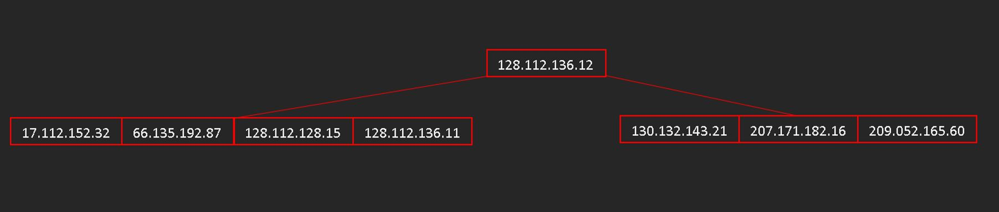

# lab04groupEDA
<table>
    <theader>
        <tr>
            <td></td>
            <th>
                <span style="font-weight:bold;">UNIVERSIDAD NACIONAL DE SAN AGUSTIN</span><br />
                <span style="font-weight:bold;">FACULTAD DE INGENIERÍA DE PRODUCCIÓN Y SERVICIOS</span><br />
                <span style="font-weight:bold;">ESCUELA PROFESIONAL DE INGENIERÍA DE SISTEMAS</span>
            </th>
            <td></td>
        </tr>
    </theader>
    <tbody>
        <tr><td colspan="3"><span style="font-weight:bold;">Formato</span>: Guía de Práctica de Laboratorio / Talleres / Centros de Simulación</td></tr>
        <tr><td><span style="font-weight:bold;">Aprobación</span>:  2022/03/01</td><td><span style="font-weight:bold;">Código</span>: GUIA-PRLD-001</td><td><span style="font-weight:bold;">Página</span>: 1</td></tr>
    </tbody>
</table>
</div>
<div align="center">
    <span style="font-weight:bold;"><h2>INFORME DE LABORATORIO 6</h2></span>
</div>


<table>
<theader>
    <tr><th colspan="6" style="width:50%; height:auto; text-align:center">INFORMACIÓN BÁSICA</th></tr>
</theader>
<tbody>
    <tr>
        <td>ASIGNATURA:</td><td colspan="5">Estructuras de Datos y Algoritmos</td>
    </tr>
    <tr>
        <td>TÍTULO DE LA PRÁCTICA:</td><td colspan="5">Árbol B</td>
    </tr>
    <tr>
        <td>NÚMERO DE PRÁCTICA:</td><td>05</td><td>AÑO LECTIVO:</td><td>2022 A</td><td>NRO. SEMESTRE:</td><td>III</td>
    </tr>
    <tr>
        <td colspan="2">FECHA DE PRESENTACIÓN:</td><td>07-Agosto-2022</td><td colspan="2">HORA DE PRESENTACIÓN:</td><td>11:55</td>
    </tr>
    <tr>
        <td colspan="3">INTEGRANTES:
        <ol>
        <li>Blanco Trujillo, Antony Jacob</li>
        <li>Checalla Soto, Edisson Franklin</li>
        <li>Vilca Suelo, Gionvanni Gabriel</li>
        </ol>
        </td>
        <td colspan="2"> NOTA:</td>
        <td>     </td>
    </tr>
    <tr>
        <td colspan="6">DOCENTE:<br>
        Mg. Richart Smith Escobedo Quispe
        </td>
    </tr>
</table>

#
<div align="center">
    <span style="font-weight:bold;"><h2>I. SOLUCIÓN Y RESULTADOS </h2></span>
</div>

#
## SOLUCIÓN DE EJERCICIOS/PROBLEMAS

#
## Ejercicio 1: Modificar el método de obtención de valor dado una clave (5 puntos)

- ¿Como puedo compilar este ejercicio correctamente en mi pc?

Despúes de clonar este repositorio, para poder ejecutar este ejercicio (Ejericio01) sin dificultad es recomendable que se ejecute desde el IDE eclipse, pues su desarrollo se dio en este,y por ello mismo es que se subieron tambien los archivos necesarios para ejecutarse ahí. Sin embargo, al tener implementado todo el código en una sola clase de JAVA, puede ejecutarse con normalidad desde la consola.

</div>

- Enlace a código en GitHub (solo código): [Ver Código](https://github.com/AntonyBlanco/lab05groupEDA/blob/main/Ejercicio01/CorchetesEquilibrados.java)

- Planificamos La Resolución:

En sesiones anteriores habíamos hablado de las posibilidades del uso de pilas y colas para la solución de implementaciones que requiriesen almacenar informacón para luego retrotraer estas, por ejemplo, en la implementación de el conocido comando "CTRL+Z". Pues bien, ahora, para solucionar los requerimientos del primer Problema  de los ejercicios propuestos en: [Repositorio con Ejercicios propuestos](https://github.com/rescobedoq/eda/tree/main/labs/lab05) vamos a hacer uso de estas estructuras de datos para poder equilibrar los corchetes.

La idea es que tengamos una Pila y Una Cola. Una pila para almacenar las llaves de apertura y una cola para almacenar las llaves de cierre. 

Por Ejemplo: Almacenaremos las llaves de esta cadena segun corresponda.

-   La cadena de llaves:

<div align="center">

.png)
</div>

-   Iniciamos La Implememntación:

Ahora que tenemos la idea más clara de como implementaremos los requerimeintos vamos a ir con ello:


-   Parte 1

Primero, vamos a implmentar una funcion que permita Llenar asignar los valores númericos que habiamos propuesto a acada llave. Entonces tenemos:


```sh 
	public static int relacionarLLaves(char c) {
		int valor=0;
		char [] corchetes = {'{','}','[',']','(',')'};
		int  [] valorNum = {1,-1,2,-2,3,-3};
		for (int i = 0; i < corchetes.length; i++) {
			if (c==corchetes[i]) {
			valor= valorNum[i];
			}
		}
		return valor;
	}
```
En esta sección no hay mayor secreto. Hacemos uso de un arreglo para poder asignar a un caracter que se ingrese un valor númerico. 

-   Parte 2

Ya que tenemos lista la función de asignación, ahora vamos a crear una función "LlenarColaYPila" la que permitirá agregar los valores númericos de las llaves de apertura en una pila y los valores númericos de las llaves de cierre en una cola. Así tenemos:

```sh 
	public static void llenarColaYPila(String cadena) {
		for (int i = 0; i < cadena.length(); i++) {
			if ((i<cadena.length()/2)) {
				pila.push(relacionarLLaves(cadena.charAt(i)));
			}else {
				cola.offer(relacionarLLaves(cadena.charAt(i)));
			}
		}
	}
```
Vemos que para lograr una asignación. dividimos en dos el tamaño de la cadena, esto para forzar a que la primera mitad de los caracteres(valores númericos) se vayan a alamcenar en la pila, y la siguiente tanda en de caracteres (valores numericos) en la cola.


-   Ejecución: Imagenes de la ejecución Corchetes equilibrados con distintas salidas

Ejemplo 1:

<div align="center">

.png)
</div>


#
## Ejercicio 2: Mostrar en un diagrama de árbol gráficamente la estructura final para los datos ingresados. (4 puntos)


-   En esta sección vamos a hacer una implementación manual. para ello le mostramos los pasos realizados.

-   Iniciamos La Resolución...


Parte 1
<div align="center">


</div>

Parte 1
<div align="center">


</div>

Parte 2
<div align="center">


</div>

Parte 3
<div align="center">


</div>

Parte 4
<div align="center">


</div>

Parte 5
<div align="center">


</div>

Parte 6
<div align="center">


</div>

Parte 7
<div align="center">


</div>


#
## Ejercicio 3: El método toString() del árbol, retorna lo siguiente. ¿Por qué están entre paréntesis ciertas claves? (4 puntos)

-Mostrar paso a paso el arbol-B al eliminar " www.espn.com": (4 puntos)

Se realizó la implementación de inserción de un árbol AVL basado en la implementación de un Arbol Binario de Busqueda.

Se diseñaron pruebas para diferentes casos como la aplicacion de rotaciones cuando el factor de equilibrio supera los límites definidos por la definición de un arbol AVL.

El código se puede revisar en el siguiente link: [Arbol AVL](https://github.com/AntonyBlanco/lab05groupEDA/tree/main/Ejercicio03) ubicado en el directorio "Ejercicio03" del repositorio actual.

#
## Ejercicio 4: Agregar un nodo adicional (www.youtube.com, 134.24.13.78) y mostrarlo paso a paso. (3 puntos)

- ¿Como puedo compilar este ejercicio correctamente en mi pc?

Para este ejercicio en particular no se requiere de compilar algun código, sin embargo, si quisieramos seguir la secuencia de inserciones, deberíamos de agregar la siguiente linea de código post las inserciones de los ejercicios previos. 

```sh 
	//Ejercicio 4: agregamos nodo adicional (www.youtube.com, 134.24.13.78)
	//st.put("www.youtube.com", "134.24.13.78");
```

Este código los podemos ejecutar desde el archivo de java denominado  [test4](https://github.com/AntonyBlanco/lab06groupEDA/blob/echecalla/Test4.java)

-   Gráficamente:

Previamente se nos pedia que eliminasemos el nodo que contenia la clave "www.espn.com, 134.24.13.78". Gráficamente tendríamos:

<div align="center">


</div>

-   Ahora podemos proceder a insertar el nodo con la clave requerida, para eso tenemos.

-   Paso 1

<div align="center">


</div>
Procedemos a buscar la ubicación correcta para esta clave. Esta se encuentra en la parte final del arbol.procedemos a agregar el nodo, quedando con 4 nodos, lo que significa unas modificaciones más...

-   Paso 2

<div align="center">


</div>

Procedemos a reubicar uno de los nodos excedentes, en este caso el de la clave de "yahoo", sin embargo en su reubicación aun hay un desajuste que debemos corregir.

-   Paso 3
<div align="center">


</div>

Hacemos una última rehubicación y logramos insertar correctamente la clave solicitada.

#
<div align="center">
    <span style="font-weight:bold;"><h2>III. CONCLUSIONES </h2></span>
</div>

#

-   Las colas y pilas se van a utilizar como una solución precisa para diversos problemas de administración de la información así como la ordenada ejecución de procesos.


#
<div align="center">
    <span style="font-weight:bold;"><h2>RETROALIMENTACIÓN </h2></span>
</div>

#

-   

#
<div align="center">
    <span style="font-weight:bold;"><h2>REFERENCIAS Y BIBLIOGRAFÍA </h2></span>
</div>

#

-   https://www.w3schools.com/java/
-   https://www.eclipse.org/downloads/packages/release/2022-03/r/eclipse-ide-enterprise-java-and-web-developers
-   https://cmps-people.ok.ubc.ca/ylucet/DS/BTree.html 
